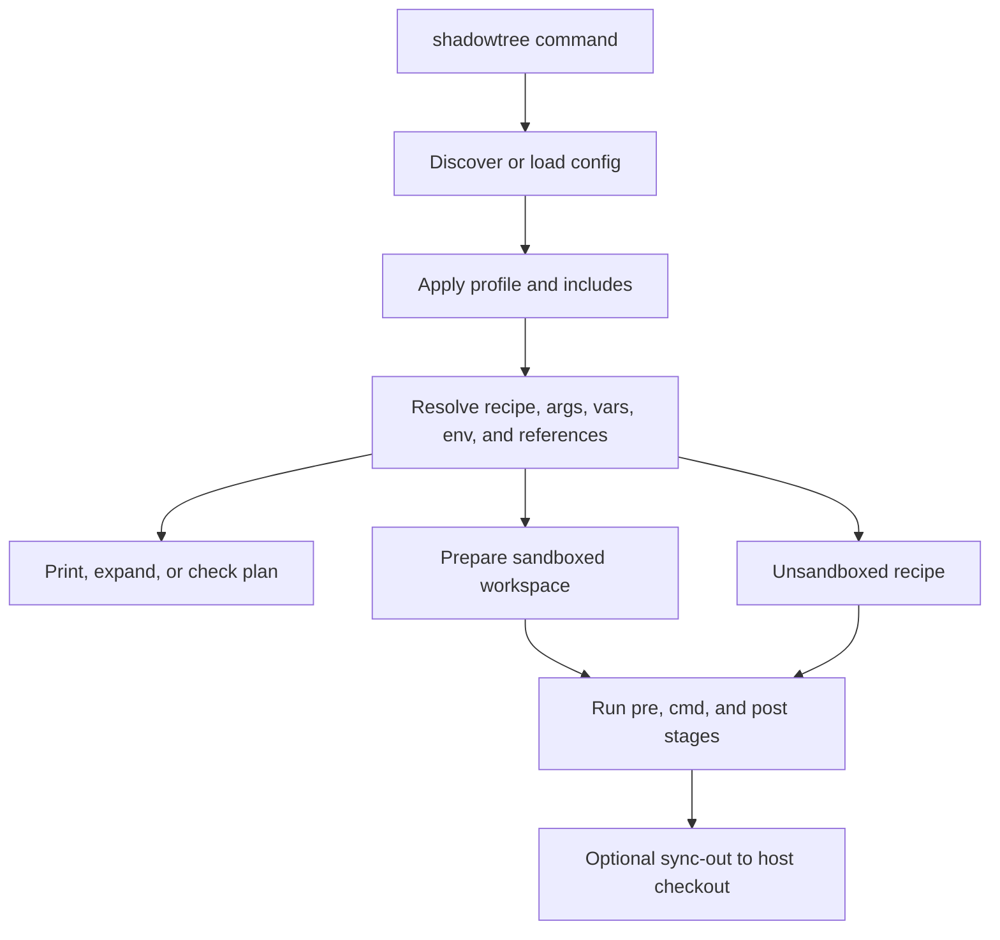

# Shadowtree

Project-local recipes for repeatable development workflows.

`shadowtree` resolves commands from `.shadowtree.toml`, prints inspectable
execution plans, and runs recipes in a disposable workspace by default. Use it
for checks, builds, generation, cleanup, install steps, and other project
commands that should be easy to discover, complete in a shell, and run without
accidentally mutating the host checkout.

TL;DR: use `shadowtree recipes` to see what a project exposes, use
`shadowtree --print <recipe>` before unfamiliar work, use `shadowtree <recipe>`
to run it in a sandbox, and use `--sync-out` or `sandboxed = false` only when
the workflow is meant to change the checkout.

## Quick Start

```sh
# 1. Install the CLI
go install github.com/yusing/shadowtree/cmd/shadowtree@latest

# 2. Create a project config
shadowtree init

# 3. Inspect and run recipes
shadowtree recipes
shadowtree --print test
shadowtree test
```

`go install` writes to `$(go env GOPATH)/bin` by default; make sure that
directory is on `PATH`.

Without a config file, Shadowtree can detect nearby Go, Node, or Rust project markers
and expose profile built-ins. A discovered config controls the recipe set
exactly unless it opts into a profile with `profile = "go"`,
`profile = "node"`, or `profile = "rust"`.

## Everyday Workflows

<!-- markdownlint-disable MD013 -->

| Workflow | Command | Output |
| --- | --- | --- |
| List available recipes | `shadowtree recipes` | Resolved recipe names and help text |
| Inspect a recipe | `shadowtree help test` | Recipe help, args, requirements, stages, and sync-out paths |
| Print a plan | `shadowtree --print test` | Resolved plan without running commands |
| Print expanded details | `shadowtree --print --expanded test` | Expanded scripts, args, vars, env, logs, and sync-out paths |
| Validate a recipe | `shadowtree --check test` | Resolution checks without command execution |
| Parse expanded shell | `shadowtree --check --shell test` | Resolution checks plus `sh`/`bash` parsing |
| Run a recipe | `shadowtree test` | Sandboxed execution by default |
| Run every supported target | `shadowtree --all test` | Recipe-specific aggregate plan |
| Run a one-off command | `shadowtree exec -- go test ./...` | Sandboxed one-off command execution |
| Copy selected outputs back | `shadowtree --sync-out dist build-assets` | Successful sandbox run plus selected host updates |
| Install completion | `shadowtree completion bash\|fish\|zsh` | Shell completion script |

<!-- markdownlint-enable MD013 -->

Global flags come before the command or recipe name:

```sh
shadowtree --verbose test ./...
```

Arguments after the recipe name are recipe arguments or are forwarded to the
main command, depending on the recipe.

## Why Shadowtree?

Project scripts tend to sprawl across `Makefile`, package scripts, shell
helpers, ad hoc README snippets, and CI-only commands. That makes it hard to
answer basic questions before running them: what will execute, where will it
write, which arguments are accepted, and whether generated files will touch the
checkout.

Shadowtree puts those workflows behind one recipe interface:

1. It discovers or loads project-local TOML configuration.
2. It resolves profiles, includes, recipe references, typed arguments, vars,
   env, lifecycle stages, and sync-out rules into an execution plan.
3. It lets you inspect or validate that plan before running it.
4. It runs sandboxed by default, keeping ordinary command writes out of the
   host checkout.
5. It copies results back only through explicit sync-out or recipes that opt
   out of sandboxing.

## What It Provides

<!-- markdownlint-disable MD013 -->

| Surface | What it does |
| --- | --- |
| Recipe config | `.shadowtree.toml` recipes with `pre`, `cmd`, `post`, `for_each`, `workdir`, `env`, `vars`, requirements, logs, and sync-out |
| Sandboxed runs | `sandboxed = true` uses overlayfs/copy isolation, `false` runs directly, and `"system"` selects the system-container backend |
| Explicit checkout writes | Recipe `sync_out`, CLI `--sync-out`, `--sync-out-all`, or `sandboxed = false` for workflows that intentionally edit the host checkout |
| Typed arguments | Positional and named recipe inputs with defaults, validation, value providers, presets, and completion |
| Recipe references | `@recipe` and `@path:recipe` references for composing workflows without a second task language |
| Profiles | Built-in Go, Node, and Rust recipe sets, selected explicitly, by config, or by marker detection when no config is loaded |
| CLI inspection | Help, recipe listing, plan printing, expanded printing, dry checks, shell parsing, and verbose execution boundaries |
| Completion | Dynamic Bash, Fish, and Zsh completion from resolved recipes and argument values |
| Editor support | JSON Schema, VS Code schema binding, Zed language support, and `shadowtree-lsp` |

<!-- markdownlint-enable MD013 -->

## Configuration

Shadowtree discovers config upward from the current directory until the Git root
or filesystem root. Registered Git submodules continue into their superproject
when no nearer config exists. Ordinary repositories, independently nested
repositories, and linked worktrees remain discovery boundaries.

```text
.shadowtree.toml
```

Start with:

```sh
shadowtree init
```

A minimal project config looks like this:

```toml
profile = "go"
shell = "sh"

[recipes.generate]
help = "Regenerate checked-in files."
cmd = "go generate ./..."
sync_out = ["internal/generated"]

[recipes.install]
help = "Install project tools."
sandboxed = false
cmd = "go install ./cmd/tool"
```

Recipes are sandboxed unless they set `sandboxed = false` or inherit behavior
from a built-in profile. Use `sync_out` when a sandboxed recipe should copy
specific generated paths back after a successful run. Prefer narrow sync-out
paths over `--sync-out-all`.

`sandboxed = "system"` is an explicit third mode. Static help and plan output
show it as `system` with `runtime: <not probed>` and never contact a container
engine. Execution and `--check` probe Docker, Podman, then nerdctl and select
the first reachable client with the required build, image, volume, mount,
identity, signalling, and cleanup operations. Detection is bounded, reports
progress on stderr, and creates no runtime or workspace state. It never falls
back to workspace or host execution.

System mode resolves a pinned profile image and five immutable content-keyed
stages for base metadata, tooling, system packages, recipe tools, and locked
project dependencies. `system.base_image` accepts a literal non-`latest`
override; `requires.system_packages` selects normalized distribution packages.
Expanded static plans expose every generated Containerfile without contacting
the runtime. Execution then runs the complete lifecycle in one automatically
removed, read-only-root container against a private copied workspace at the
canonical checkout path. Nested references stay in that container; only a
successful lifecycle applies configured sync-out paths.

Includes, vars, env, typed arguments, command requirements, logging, lifecycle
stages, and recipe references are documented in the
[manual](https://yusing.github.io/shadowtree/).

## CLI Reference

Common commands:

```sh
shadowtree [flags] <recipe> [args...]
shadowtree [flags] exec -- <cmd> [args...]
shadowtree help [recipe [color=false]]
shadowtree recipes
shadowtree config
shadowtree init [path]
shadowtree completion bash|fish|zsh
```

Global flags:

<!-- markdownlint-disable MD013 -->

| Flag | Purpose |
| --- | --- |
| `--config <path>` | Use an explicit config file |
| `--profile go\|node\|rust` | Select built-in profile recipes |
| `--all` | Run the selected recipe for its profile-defined aggregate targets |
| `--sync-out <path>` | Copy selected paths back after a successful sandboxed run |
| `--sync-out-all` | Copy the whole sandbox workspace back after success |
| `--print` | Print the resolved plan without running |
| `--expanded` | With `--print`, include expanded scripts, values, env, logs, and sync-out paths |
| `--check` | Validate the resolved recipe without running commands |
| `--shell` | With `--check`, parse expanded `sh` and `bash` scripts |
| `--verbose` | Show workspace details and compact stage boundaries |
| `--help` | Show basic CLI help |
| `--version` | Print the version |

<!-- markdownlint-enable MD013 -->

See `shadowtree help`, `shadowtree help <recipe>`, and the
[CLI inspection guide](https://yusing.github.io/shadowtree/cli-inspection.html)
for exact output.

## Profiles

Profiles provide built-in recipes for common projects.

Go projects expose recipes such as `test`, `test-race`, `vet`, `check`, `build`,
`generate`, `install`, `lint`, `fmt`, `fix`, `tidy`, and `run`. Normal built-ins
execute once. `--all` selects a recipe-specific aggregate plan: package
recipes cover all packages, `build` and `install` cover main packages, and
`tidy` covers modules. Built-in `fix`, `fmt`, and `tidy` are unsandboxed because
they are meant to update the checkout.

Aggregate invocations reject an explicit primary target. Tool flags can still
be forwarded; use the passthrough delimiter when a flag takes a separate bare
value, for example `shadowtree --all test -- -run TestName`.

Node projects expose recipes such as `install`, `dev`, `build`, `start`,
`test`, `lint`, `fmt`, `typecheck`, and `check`. Package manager, script,
framework, test, lint, formatter, and typechecker inference comes from
`package.json`, lockfiles, installed dependencies, and common config markers.
Node built-ins are unsandboxed by default because package-manager and framework
commands commonly mutate project state.

Rust projects expose `check`, `test`, `build`, `run`, `fmt`, and `clippy`.
`--all` uses Cargo workspace semantics for every recipe except `run`, which
requires an explicit binary. Shadowtree resolves the workspace, exact Rust
toolchain, host and target triples, lockfile, and project-scoped cache contract
without installing toolchains or optional components.

Profile selection precedence:

1. explicit `--profile`
2. config `profile`
3. marker detection only when no config is loaded

## How It Works



For sandboxed runs, Shadowtree skips `.git`, `.shadowtree`, and
`.shadowtree.*` while preparing workspaces. Go build recipes that require
stable behavior should use `-buildvcs=false` when they run without `.git`.

## Documentation

- [Manual home](https://yusing.github.io/shadowtree/)
- [Getting started](https://yusing.github.io/shadowtree/getting-started.html)
- [Sandboxing and sync-out](https://yusing.github.io/shadowtree/sandboxing-and-sync-out.html)
- [Configuration files](https://yusing.github.io/shadowtree/configuration.html)
- [Recipe fields](https://yusing.github.io/shadowtree/recipes.html)
- [Typed arguments](https://yusing.github.io/shadowtree/typed-arguments.html)
- [Profile selection](https://yusing.github.io/shadowtree/built-in-profiles.html)
- [CLI inspection](https://yusing.github.io/shadowtree/cli-inspection.html)
- [Editor support](https://yusing.github.io/shadowtree/editor-support.html)
- [Full behavior spec](https://yusing.github.io/shadowtree/reference/spec.html)

## Development

Use the local CLI before installing a binary:

```sh
go run ./cmd/shadowtree recipes
go run ./cmd/shadowtree test
go run ./cmd/shadowtree check
go run ./cmd/shadowtree build
go run ./cmd/shadowtree fmt
go run ./cmd/shadowtree tidy
```

The repository's own `.shadowtree.toml` uses the Go profile and adds project
recipes such as `build`, `ci-test`, `install`, and `install-skill`.
